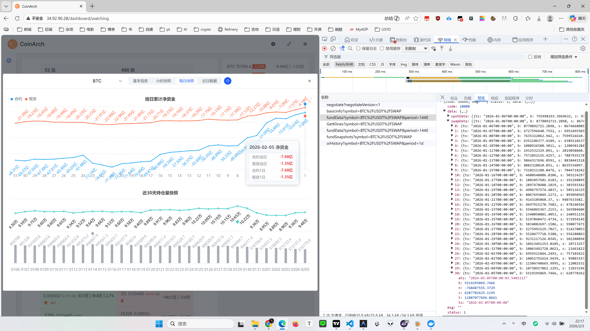

## main page
CoinArch
数据聚合
盯盘
合约
现货
异动统计
计算器
103 涨
RAYSOL0.70919.41% [7] 0.4
96.1万 | 31.7%
G0.004345.67% [7] -1.1
31.9万 | 2.3万 | 6.9%
UAI0.20785.16% [1] 0.6
8.5万 | 0.8%
XPIN0.0023034.30% [1] 0.3
10.2万 | 0.5%
CYS0.3533.40% [4] 🔥0.2
13.7万 | 3.5%
RIVER14.4463.07% ❄️
77.4万 | 1.9%
ARC0.065553.07% [10] 🔥-7.6
21.6万 | 0.1%
ENSO1.29152.72% [7] 🔥-1.3
15.1万 | 1.0万 | -0.1%
XNY0.0040771.75% ⛅
-1.2万 | 0.2%
ACU0.16341.60% ❄️
2.4万 | -0.9%
GPS0.0085561.60% 🔥
1.8万 | 6514.7 | 0.4%
VELVET0.12331.54%
1.2万 | -0.1%
CTK0.22131.51%
5795.2 | 2012.1 | -0.0%
TAC0.0042241.49%
8212.3 | 0.5%
BDXN0.014961.42% ⛅
-5143.8 | 0.5%
SIREN0.090191.13%
1.2万 | -0.1%
CELO0.091.12%
-3049.1 | -5435.0
SQD0.05461.09%
1.6万 | -3.3%
CARV0.07071.00%
6362.6 | 0.3%
GTC0.1050.96%
8737.3 | -14.2 | -0.3%
423 跌
COLLECT0.03662-5.18% [1] ❄️
-7.8万
CLO0.0972-3.76% [1] ⛅
-24.9万
TAG0.000384-3.57% [3]
-6.7万
ZKP0.08858-3.43% ⛅
-13.2万 | -4.2万
BIRB0.26246-3.14% [2] 🔥
-26.7万
F0.005638-2.76%
-9.0万 | -6599.5
ANKR0.005125-2.60%
-7.0万 | -5661.7
DOOD0.004239-2.51%
-4.2万
ZORA0.02546-2.38%
3.0万
ALCH0.08282-2.37% ⛅
-7445.4
ZK0.02254-2.34% 🔥
-22.2万 | 1.7万
BOB0.007377-2.33%
-1.7万
SPORTFUN0.03611-2.27%
-2.3万
TRUTH0.014818-2.14%
7518.1
AIO0.15467-2.11%
-1.6万
SKR0.017234-2.04% 🔥
3552.3
AUCTION4.873-2.03% [1] 🔥
3.1万 | -8906.2
SENT0.03018-2.01% 🔥
-15.2万 | -14.3万
PROMPT0.06145-1.92%
-4235.5
USELESS0.03954-1.89%
2.1万
滚动 / 近15分钟
08:22-08:37
UAI0.20765.06%
3.80%
XPIN0.0023024.26%
2.36%
ENSO1.29092.67% 🔥
1.55%
VELVET0.123441.66%
1.33%
BULLA0.033180.18% 🔥
1.28%
COAI0.31210.45%
1.20%
APR0.07630.75%
0.99%
BIGTIME0.016970.95%
0.83%
OPEN0.16550.06%
0.79%
XNY0.0040771.75% ⛅
0.79%
ARC0.065553.07% 🔥
-6.86%
TAG0.0003841-3.54%
-2.93%
ZORA0.02545-2.42%
-2.41%
ZAMA0.0285-0.70% ❄️
-2.06%
EUL1.156-1.62% ❄️
-1.78%
ZKC0.09390.43% 🔥
-1.57%
B0.1892-1.05%
-1.56%
ZEC251.13-0.24%
-1.54%
SKR0.017229-2.06% 🔥
-1.49%
ZIL0.0053-0.56% 🔥
-1.49%
K线 / 1小时
08:00-09:00
RAYSOL0.70919.41%
9.43%
UAI0.20765.06%
5.16%
XPIN0.0023024.26%
4.30%
G0.004345.67%
3.93%
CYS0.3533.40% 🔥
3.85%
ARC0.065553.07% 🔥
3.05%
ENSO1.29092.67% 🔥
3.03%
RIVER14.4413.03% ❄️
2.97%
XNY0.0040771.75% ⛅
1.80%
CTK0.22111.42%
1.61%
FLUID2.474-1.39%
-6.99%
COLLECT0.03663-5.15% ❄️
-5.10%
CLO0.0971-3.86% ⛅
-3.76%
TAG0.0003841-3.54%
-3.69%
BIRB0.26249-3.13% 🔥
-3.47%
ZKP0.08859-3.42% ⛅
-3.34%
F0.005636-2.79%
-2.63%
DOOD0.004239-2.51%
-2.46%
BOB0.007377-2.33%
-2.39%
ANKR0.005125-2.60%
-2.34%

收藏

热点
0个
暂无数据
BTC
72957.6
-0.25%
2889.37万 | 190.70万
ETH
2148.99
0.09%
351.49万 | 30.19万
SOL
91.5
-0.62%
67.48万 | -80.43万
PAXG
5034.3
0.10%
125.19万 | 38.55万
市场异动
SWARMS - ₮0.00789 (-1.13%) , 跌破短线第1/3强支撑0.00791,下一支撑0.00752,日内振幅1.38%,用时1小时22分[2-5 11:34 3 分钟前]
ARC - ₮0.0665 (4.65%) , 9分钟跌 -5.22% , 日内回调 -5.67% [10] 🔥[2-5 11:33 4 分钟前]
UAI - ₮0.2068 (4.66%) , 涨至短线第1/4阻力附近0.2093,日内振幅5.11%,用时1小时56分 ❄️[2-5 11:33 4 分钟前]
UAI - ₮0.2066 (4.55%) 启动 , 量能0.5x , 持仓+0.35% , 净流入7.28万 ❄️[2-5 11:33 4 分钟前]
EUL - ₮1.157 (-1.28%) , 7分钟跌 -5.01% (10天首次) [5] ⛅️[2-5 11:32 5 分钟前]
ENSO - ₮1.2761 (1.59%) , 4分钟跌 -3.05% [7] 🔥[2-5 11:31 6 分钟前]
XPIN - ₮0.002298 (3.99%) , 涨至短线最后阻力附近0.002335,日内振幅4.21%,用时1小时6分[2-5 11:28 8 分钟前]
XPIN - ₮0.002297 (4.08%) 启动 , 量能5.1x , 持仓+0.11% , 净流入4.86万 , 自48天前的低点反弹33.01% , 市值4086.36万[2-5 11:28 9 分钟前]
EUL - ₮1.181 (0.09%) , 2分钟跌 -3.04% [3] ⛅️[2-5 11:27 9 分钟前]
ARC - ₮0.06793 (6.81%) , 3分钟跌 -3.18% [9] 🔥[2-5 11:27 10 分钟前]
VELVET - ₮0.12341 (1.63%) , 涨至短线最后阻力附近0.12429,日内振幅2.67%,用时8分[2-5 11:26 11 分钟前]
RAYSOL - ₮0.7018 (8.42%) , 持仓+30.8% , 总持仓260.25万U ≈ 0.67%市值 [6][2-5 11:25 11 分钟前]
ENSO - ₮1.3075 (4.72%) 快涨 ⬆️ , 量能2.8x , 持仓-0.98% , 净流入27.4万 [6] 🔥[2-5 11:24 13 分钟前]
ENSO - ₮1.3023 (3.58%) , 5分钟涨 3.10% [5] 🔥[2-5 11:24 13 分钟前]
EUL - ₮1.216 (3.40%) , 5分钟涨 3.31% [2]

## Coin detail page

### 1. 基本信息
今日价格	₮72933.0 (-0.28%)价格区间	底部 (6天22小时)振幅量能	0.79% , 0.64x今日波动	0次 摸顶探底	第5次新低 (2小时前)昨日涨幅	-3.43%上周涨幅	-11.19%本周涨幅	-5.20%六日趋势	4分 (强下降)60日趋势	35分 (下降)持仓数量	9.3万币 (-0.0%)持仓价值	68.41亿U (-0.3%)头寸规模	0.5%资金费率	+0.0100%流通市值	1.45万亿 (95.16%)稀释市值	1.53万亿多空比	人数|大户数|大户持仓03:00	 2.93 | 3.60 | 1.9304:00	 2.95 | 3.62 | 1.9405:00	 2.94 | 3.61 | 1.9506:00	 2.97 | 3.65 | 1.9507:00	 2.95 | 3.66 | 1.93 短线支撑	(根据近5日数据分析)1	71906.80 短线阻力	(根据近5日数据分析)1	73823.90 - 74180.702	75197.00 - 75635.603	76497.00 - 76923.004	78832.40 - 79345.205	83759.90 - 84205.10
### 2.小时快照
主要显示过去24小时每小时合约现货净流入

### 3. 每日快照

### 4.近日数据

